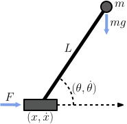
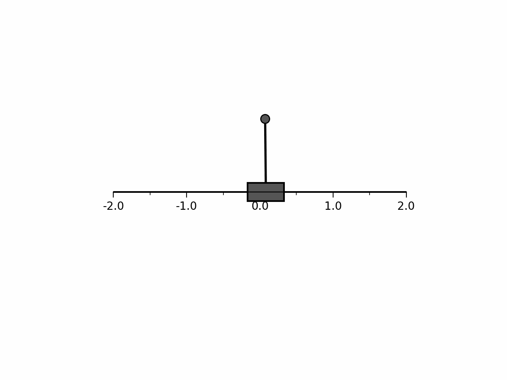
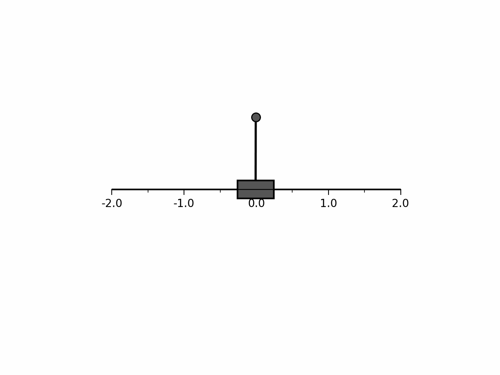
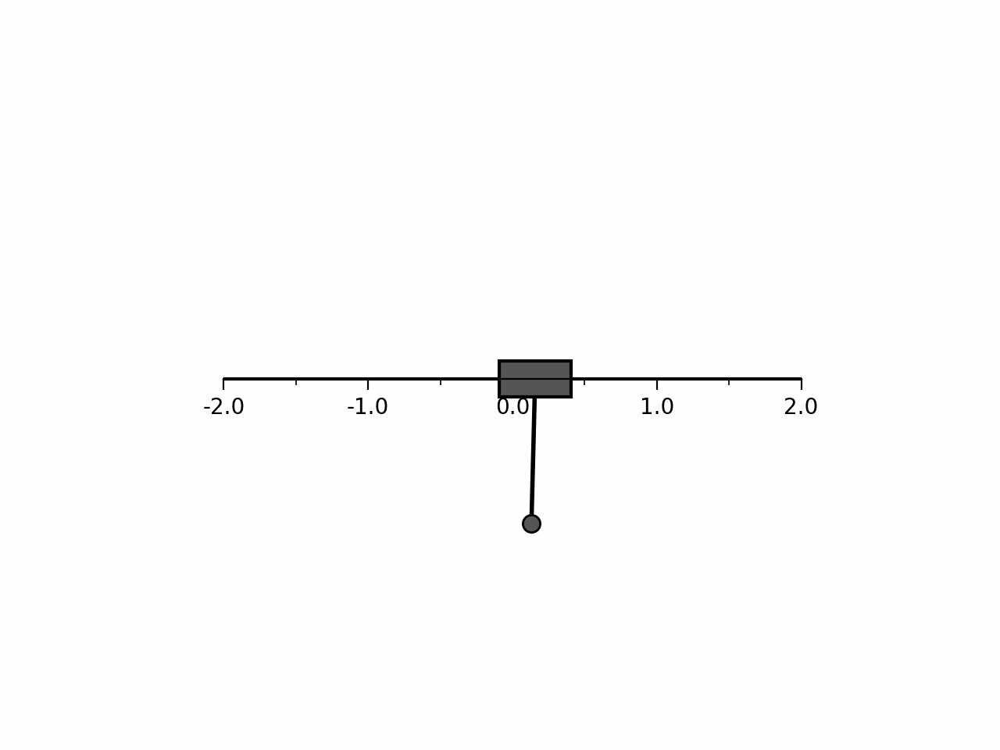

# Reinforcement Learning for the Inverted Pendulum Problem

This project explores the application of various reinforcement learning (RL) algorithms to the classic inverted pendulum problem. The inverted pendulum is a common challenge in control theory, involving balancing a pendulum upright on a moving cart by applying appropriate horizontal forces. This setup serves as an excellent testbed for experimenting with RL algorithms in a practical setting.

## Overview

The goal of this project is to swing up and balance the pendulum in the upright position by applying forces to the cart. A custom simulation environment was developed to model the physics of the pendulum and cart system. Three different RL algorithms were implemented and evaluated:

- **Deep Q-Network (DQN)**: Approximates the state-action value function $Q(s, a)$ using a neural network, enabling the agent to select actions that maximize expected rewards. The DQN model outputs estimates of the Q-values for each action in the action space, conditional on the current state. It is limited to discrete action-spaces since it explicitly models the Q-values for each action. In this project, the actions correspond to applying a force to the cart in either the left or right direction. Q-value estimates are improved through minimizing the temporal difference error based on observed transitions. After training, the agent can use the Q-value estimates to select actions that maximize the expected return.
- **REINFORCE (Monte Carlo Policy Gradient)**: Directly learns the policy \( \pi(a | s) \), which outputs a probability distribution over the possible actions given the current state. Since it explicitly models the probability of choosing each action, it is also limited to discrete action-spaces. The REINFORCE algorithm samples full episodes from the environment and computes the discounted return for each transition in the episode. The policy parameters are then updated along the gradient of the log-probability of the chosen action multiplied by the discounted return. This encourages actions that lead to higher returns to be chosen more frequently in the future.
- **Deep Deterministic Policy Gradient (DDPG)**: An actor-critic method that concurrently learns a Q-function (critic) and a policy (actor). The actor model, denoted by \( \mu(s) \), outputs a deterministic action given the current state. The critic model, denoted by \( Q(s, a) \), receives the state and action as inputs and outputs the estimated Q-value. The critic is trained to minimise the temporal difference error, in a similar manner to the DQN algorithm. The actor model is trained by computing the gradient of the Q-value with respect to the actor's parameters. This gradient is used to update the actor's parameters, leading to actions that maximize the estimated Q-value. This method allows the actor to output continuous actions, which in this project correspond directly to the force applied to the cart.

## Implementation

The project is structured into several components:

1. **Simulation Environment**: A physics-based simulation of the inverted pendulum on a cart, allowing for customizable parameters like mass, length, friction, and gravity.
2. **RL Algorithms**: Implementations of DQN, REINFORCE, and DDPG algorithms, each with tailored neural network architectures and learning procedures.
3. **Visualization Tools**: Functions to animate and visualize the pendulum's behavior during training and testing, aiding in qualitative assessment.

## Results

### Balancing from Upright Position

All three algorithms were tested on their ability to balance the pendulum starting from the upright position. The performance differences are evident in the animations below.

|  |  |  |
|:---:|:---:|:---:|
| **DDPG** | **DQN** | **REINFORCE** |

- **DDPG**: Exhibited smooth and stable balancing due to its continuous action space, allowing for precise adjustments.
- **DQN** and **REINFORCE**: Managed to balance the pendulum but with noticeable jitteriness. Their discrete action spaces limited control to fixed left or right forces, resulting in less fluid movements.

### Swinging Up from Downward Position

The algorithms were also evaluated on their ability to swing the pendulum up from the downward position and maintain balance. The figure below illustrates the results achieved by the DDPG algorithm.

- **DDPG**: Successfully learned to swing up and balance the pendulum. The continuous action space was crucial for applying the nuanced forces required for this complex task.
- **DQN** and **REINFORCE**: Were unable to achieve the swing-up due to the limitations inherent in their discrete action spaces.
