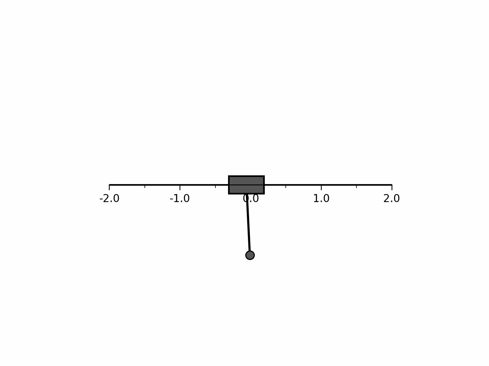

# Reinforcement Learning for the Inverted Pendulum Problem

This project explores the application of various reinforcement learning (RL) algorithms to the classic inverted pendulum problem. The inverted pendulum is a common challenge in control theory, involving balancing a pendulum upright on a moving cart by applying appropriate horizontal forces. This setup serves as an excellent testbed for experimenting with RL algorithms in a practical setting.

## Overview

The goal of this project is to swing up and balance the pendulum in the upright position by applying forces to the cart. A custom simulation environment was developed to model the physics of the pendulum and cart system accurately. Three different RL algorithms were implemented and evaluated:

- **Deep Q-Network (DQN)**: Approximates the state-action value function $Q(s, a)$ using a neural network, enabling the agent to select actions that maximize expected rewards.
- **REINFORCE (Monte Carlo Policy Gradient)**: Directly learns the policy $\pi(a | s)$ by optimizing the expected return through gradient ascent, without explicitly modeling the value function.
- **Deep Deterministic Policy Gradient (DDPG)**: An actor-critic method that concurrently learns a Q-function (critic) and a policy (actor) in a continuous action space, suitable for problems requiring fine control.

## Implementation

The project is structured into several components:

1. **Simulation Environment**: A physics-based simulation of the inverted pendulum on a cart, allowing for customizable parameters like mass, length, friction, and gravity.
2. **RL Algorithms**: Implementations of DQN, REINFORCE, and DDPG algorithms, each with tailored neural network architectures and learning procedures.
3. **Visualization Tools**: Functions to animate and visualize the pendulum's behavior during training and testing, aiding in qualitative assessment.

## Results

### Balancing from Upright Position

All three algorithms were tested on their ability to balance the pendulum starting from the upright position. The performance differences are evident in the animations below.

|  |  |  |
|:---:|:---:|:---:|
| **DDPG** | **DQN** | **REINFORCE** |

- **DDPG**: Exhibited smooth and stable balancing due to its continuous action space, allowing for precise adjustments.
- **DQN** and **REINFORCE**: Managed to balance the pendulum but with noticeable jitteriness. Their discrete action spaces limited control to fixed left or right forces, resulting in less fluid movements.

### Swinging Up from Downward Position

The algorithms were also evaluated on their ability to swing the pendulum up from the downward position and maintain balance.

- **DDPG**: Successfully learned to swing up and balance the pendulum. The continuous action space was crucial for applying the nuanced forces required for this complex task.
- **DQN** and **REINFORCE**: Were unable to achieve the swing-up due to the limitations inherent in their discrete action spaces.
