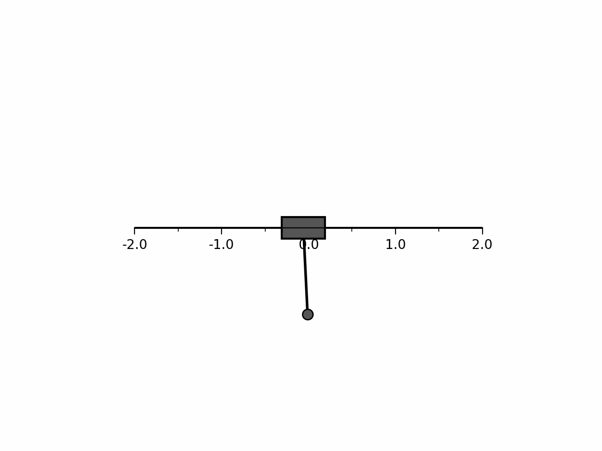

# Reinforcement Learning for the Inverted Pendulum Problem
This project regards the implementation of various reinforcement learning (RL) algorithms in a custom environment. The environment is a simulation of a pendulum mounted to a cart which can move horisontally. The goal is to swing up and balance the pendulum in the upright position by applying appropriate forces to the cart. An illustration of the environment is shown below. The inverted pendulum problem is a classical control problem and serves as an excellent example for experimenting with reinforcement learning algorithms.

 The algorithms implemented in this project are: 
- DQN (Deep Q-Network): This method aims to approximate the state-action value function, $Q(s,a)$.
- REINFORCE (Monte Carlo Policy Gradient): This method aims to directly approximate the policy function, $\pi(a|s)$; a probability distribution over actions given a state.
- DDPG (Deep Deterministic Policy Gradient): This is an actor-critic method that learns both a state-value function, $Q(s,a)$ (the critic), and a deterministic policy, $\mu(s)$ (the actor).

